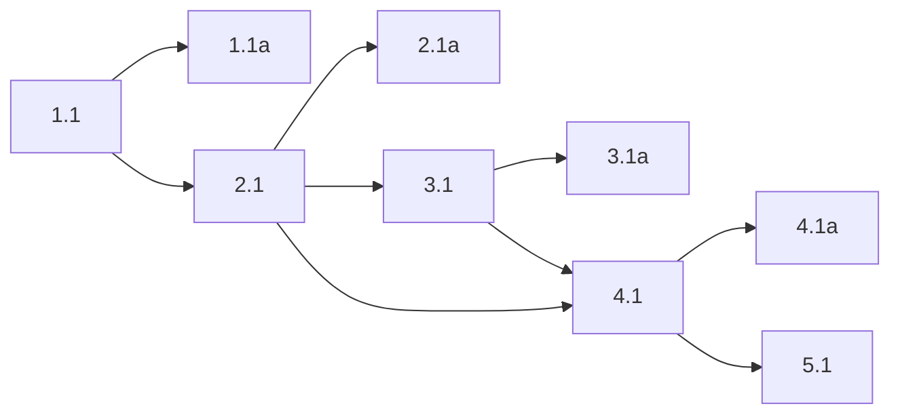

## 1. Fork-owned command-chain file loader
- [x] 1.1 Add fork-owned `danger-pi` modules for `.cmd.yaml` command files: TypeBox schema, Ajv validation, YAML parsing, filename-based command-name derivation, same-directory duplicate resolution, and grouped warning rendering.
- [x] 1.1a Verify loader behavior with focused unit tests covering valid files, invalid YAML syntax, malformed schema cases, filename-derived command names, raw-ish validation output, and same-directory duplicate reporting; capture `bun test` output for the targeted test file(s).

## 2. Built-in-provider slash-command discovery and materialization
- [x] 2.1 Hook the built-in `native` provider's slash-command discovery and slash-command loading so `.cmd.yaml` files are discovered beside `.md` in the standard OMP command directories, valid files materialize into an explicit prompt-chain file-command variant, prompt-chain execution is available through the shared file-command execution path, same-directory `.md` files win collisions, command-load warnings survive the `loadSlashCommands(...)` boundary, and multi-block prompt-chain execution is allowed only when the prompt-chain block is the final renderable block.
- [x] 2.1a Verify discovery/materialization with targeted tests covering built-in-provider command-directory loading, collision precedence, warning propagation, autocomplete-visible command registration, immediate first-step kickoff for queued commands, completed-turn (`turn_end`) deferred dispatch behavior, deferred step retry behavior, normal prompt submission, final-block multi-block prompt-chain execution, and the error path for earlier prompt-chain blocks in multi-block submissions; capture `bun test` output for the targeted test file(s).

## 3. Interactive warning emission
- [x] 3.1 Update the interactive slash-command refresh flow so startup and reload each emit one combined `showWarning(...)` block for command-file problems, while keeping those warnings out of session reconstruction and agent-visible context.
- [x] 3.1a Verify startup and reload warning emission with targeted interactive/reload tests, including backgrounded-mode `stderr` behavior where practical; capture `bun test` output (and any direct command output if needed) for the targeted verification slice.

## 4. End-to-end regression coverage
- [x] 4.1 Add regression coverage for a mixed command directory containing valid `.cmd.yaml`, invalid-YAML `.cmd.yaml`, malformed-schema `.cmd.yaml`, and colliding `.md` siblings so the full feature contract is exercised from discovery through interactive warning emission.
- [x] 4.1a Validate the end-to-end slice with the full targeted command-chain test suite and save the test output artifact demonstrating the final passing behavior.

## 5. Fork documentation
- [x] 5.1 Update `FORK.md` with a concise description of the `.cmd.yaml` command-chain-file feature, including where files live, how names are derived, how `.md` vs `.cmd.yaml` same-directory collisions resolve, and how non-fatal load errors surface to the user.

