## 1. Browser asset boundary and static inputs
- [x] 1.1 Add the browser-only viewer source files and static inputs inside `packages/coding-agent`, including: a browser client entrypoint, a minimal served HTML shell, and the static `.md` summarizer prompt file required by the summarize flow.
- [x] 1.1a Validate task 1.1 by verifying the new browser-facing sources exist in the expected package location and the summarizer prompt is stored as a text file rather than an inline code string.
- [x] 1.2 Add the client build plumbing that turns the browser entrypoint into a server-consumable asset artifact. The output must be something the extension can serve without importing the browser entrypoint module directly.
- [x] 1.2a Validate task 1.2 by producing the client asset bundle and recording evidence that server-side extension code imports only the built artifact, not the browser entrypoint and not `marked`/`dompurify` directly.

## 2. Browser viewer client
- [x] 2.1 Implement the browser client boot path so the served page opens a WebSocket to the extension, receives an initial `buffer` event immediately on connect, and re-renders whenever later `buffer` events arrive.
- [x] 2.1a Validate task 2.1 with an executable smoke test or equivalent artifact that shows the client can consume a sample `buffer` payload and replace the rendered content when a second `buffer` payload is received.
- [x] 2.2 Implement markdown rendering in the browser client with the locked pipeline `Marked.parse(...) -> DOMPurify.sanitize(..., { USE_PROFILES: { html: true } }) -> DOM update`, and add the minimal page behavior for a summarize button plus status/error display.
- [x] 2.2a Validate task 2.2 by building the browser client successfully and capturing a smoke-test artifact that proves markdown content is rendered and sanitized through the client pipeline using the HTML-only DOMPurify profile.
- [x] 2.3 Implement browser-side summarize behavior: send `{ "type": "summarize" }`, disable or ignore repeated clicks while busy, preserve the currently rendered content when an `error` event is received, and recover cleanly when busy state clears.
- [x] 2.3a Validate task 2.3 with targeted client-side verification for busy-state handling, summarize request emission, and non-destructive error display.

## 3. Extension runtime and viewer state
- [x] 3.1 Implement the bundled viewer extension under `packages/coding-agent/src/danger-pi/extensions/` and register the `/viewer` command. The command must lazily start the localhost server if needed and always open the current viewer URL in the default browser.
- [x] 3.1a Validate task 3.1 with executable verification that `/viewer` can start the server once, reuse it on subsequent invocations, and compute a launchable localhost URL.
- [x] 3.2 Implement the server routes and connection handling: serve the HTML shell, serve the built client asset, upgrade `/ws` to WebSocket, and enforce the locked last-socket-wins rule.
- [x] 3.2a Validate task 3.2 with targeted automated coverage or equivalent executable verification for route serving, socket replacement, and immediate state push on connect.
- [x] 3.3 Implement the authoritative viewer state object in the extension, including `buffer`, `revision`, `summarizeInFlight`, and active-client tracking.
- [x] 3.3a Validate task 3.3 with focused verification that state initializes correctly, survives reconnects, and does not mutate on failed summarize attempts.
- [x] 3.4 Implement completed assistant text extraction from extension-observed events. The extraction rule must include only completed assistant `text` blocks, concatenate them in order, and ignore thinking, tool calls, tool results, and non-assistant messages.
- [x] 3.4a Validate task 3.4 with targeted automated coverage or equivalent executable verification for the exact extraction rule, including at least one negative case that proves non-text or non-assistant content is excluded.

## 4. Summarization flow
- [x] 4.1 Implement the summarize request handler in the extension so it reads the authoritative buffer, snapshots the current revision, ignores duplicate summarize requests while busy, and sends `status` updates to the browser.
- [x] 4.1a Validate task 4.1 with targeted verification for busy-state transitions and duplicate-request ignore behavior.
- [x] 4.2 Implement model resolution for summarization using the user's configured `smol` role, `modelRegistry`, and `completeSimple(...)`, sourcing the summarizer instructions from the static prompt file.
- [x] 4.2a Validate task 4.2 with executable verification or equivalent test coverage that the summarize path resolves the intended `smol` model and does not route through the main agent conversation loop.
- [x] 4.3 Implement summarize success/failure handling: on success, replace the authoritative buffer with returned markdown and increment revision; on failure, keep the old buffer and emit an `error` event instead.
- [x] 4.3a Validate task 4.3 with targeted automated coverage or equivalent executable verification for success replacement, failure preservation, and correct browser event emission.
- [x] 4.4 Implement stale summarize discard using the locked revision rule so late summarize completions do not overwrite a newer assistant reply or newer summary.
- [x] 4.4a Validate task 4.4 with a deterministic test or executable scenario where summarize begins on one revision and returns after the authoritative revision has advanced.

## 5. Integration and release readiness
- [x] 5.1 Add the required package/dependency updates for the browser client asset, specifically `marked@^17.0.5` and `dompurify@^3.3.3` in `packages/coding-agent`. Do not add `jsdom`, `isomorphic-dompurify`, syntax-highlighting packages, or markdown presentation CSS for v1.
- [x] 5.1a Validate task 5.1 by verifying the dependency additions match the researched current release lines and the browser dependencies remain confined to the browser entrypoint/build boundary.
- [x] 5.1b Wire the viewer extension into the bundled Danger Pi extension registry.
- [x] 5.1c Validate task 5.1b by verifying the extension is reachable from the bundled extension registry.
- [x] 5.2 Update `packages/coding-agent/CHANGELOG.md` under `[Unreleased]` to describe the new viewer capability.
- [x] 5.2a Validate task 5.2 by verifying the changelog entry appears under the correct unreleased section and does not modify released sections.
- [x] 5.3 Run package-level verification for the implementation, including at minimum `bun check:ts` for `packages/coding-agent`, and save the output as the implementation-check artifact.
- [x] 5.3a Validate task 5.3 by confirming the verification command completed successfully and the artifact is preserved.
- [ ] 5.4 Perform an end-to-end manual viewer walkthrough from an interactive session: run `/viewer`, confirm the browser opens, confirm the current buffer is sent immediately on connect, confirm a completed assistant reply replaces the rendered content, confirm summarize replaces the browser buffer on success, confirm summarize failure leaves the buffer intact, and confirm the next completed assistant reply overwrites the summary.
- [ ] 5.4a (HUMAN_REQUIRED) Capture human confirmation and a browser artifact for the end-to-end walkthrough.
- [x] 5.5 Remove the exploratory spike files after the real implementation is in place so no temporary viewer-spike code or generation script remains in `packages/coding-agent`.
- [x] 5.5a Validate task 5.5 by verifying the spike-only files are deleted and no production code still references the temporary viewer-spike paths or helpers.

```mermaid
graph LR
  A[1.1] --> B[1.1a]
  B --> C[1.2]
  C --> D[1.2a]
  D --> E[2.1]
  D --> F[3.1]
  E --> G[2.1a]
  G --> H[2.2]
  H --> I[2.2a]
  I --> J[2.3]
  J --> K[2.3a]
  F --> L[3.1a]
  L --> M[3.2]
  M --> N[3.2a]
  N --> O[3.3]
  O --> P[3.3a]
  P --> Q[3.4]
  Q --> R[3.4a]
  R --> S[4.1]
  S --> T[4.1a]
  T --> U[4.2]
  U --> V[4.2a]
  V --> W[4.3]
  W --> X[4.3a]
  X --> Y[4.4]
  Y --> Z[4.4a]
  K --> AA[5.1]
  Z --> AA[5.1]
  AA --> AB[5.1a]
  AB --> AC[5.1b]
  AC --> AD[5.1c]
  AD --> AE[5.2]
  AE --> AF[5.2a]
  AF --> AG[5.3]
  AG --> AH[5.3a]
  AH --> AI[5.4]
  AI --> AJ[5.4a]
  AJ --> AK[5.5]
  AK --> AL[5.5a]
```

