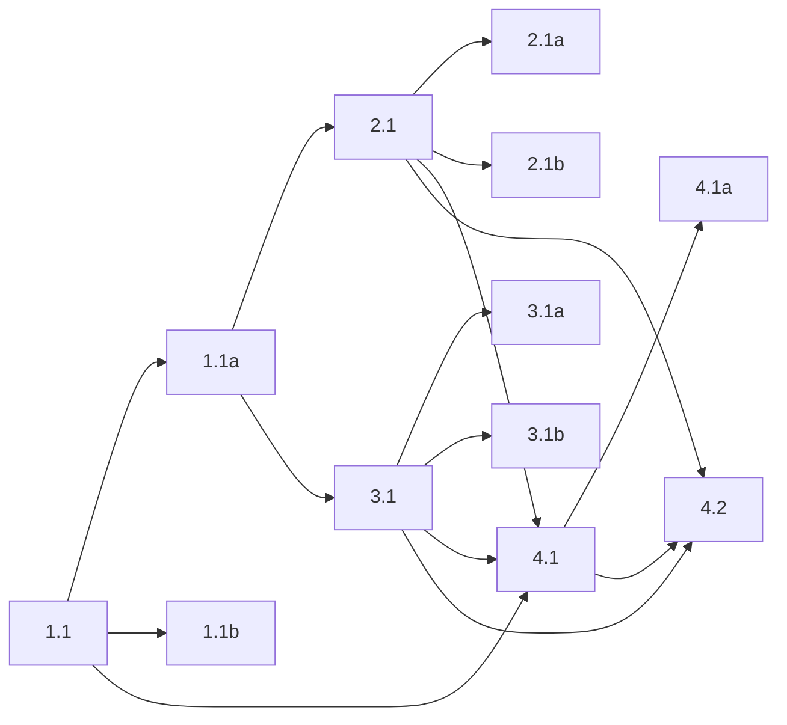

## 1. Tool-driven pager index
- [x] 1.1 Add fork-owned `pager_index` under `packages/coding-agent/src/danger-pi/` with structured `{ title, pages }` input.
- [x] 1.1a Persist pager index state as a hidden `custom` entry instead of parsing assistant `<pager-index>` text.
- [x] 1.1b Verify tool behavior with focused tests covering state persistence, immediate status update, and hidden next-turn queuing.

## 2. Pager commands, shortcut, and transcript protocol
- [x] 2.1 Keep `/pager:next` and `/pager:exit` as fork-owned extension commands backed by visible `custom_message` entries.
- [x] 2.1a Add `Ctrl+J` as the idle pager-next shortcut through the extension shortcut API.
- [x] 2.1b Verify visible next/exit behavior, final-page exit behavior, and shortcut dispatch with focused tests.

## 3. Rendering and status
- [x] 3.1 Render pager index through the tool-rendering path as a compact inline control.
- [x] 3.1a Restyle visible pager-next to show italic `Page Turn` plus `Now viewing {page title}` with bold page title.
- [x] 3.1b Keep keyed pager status derived from reconstructed state across start, rewind, branch, and exit flows.

## 4. Built-in extension wiring and interactive evaluation
- [x] 4.1 Keep pager mode wired into the fork's built-in inline-extension load path in `packages/coding-agent/src/sdk.ts`.
- [x] 4.1a Verify built-in loading with a focused session-initialization test covering tool, shortcut, commands, renderers, and status refresh.
- [ ] 4.2 (HUMAN_REQUIRED) Run an interactive OMP session with a sample pager sequence, confirm the compact index / silent auto-next / visible user-driven next flow feels right, and record follow-up UX adjustments.

