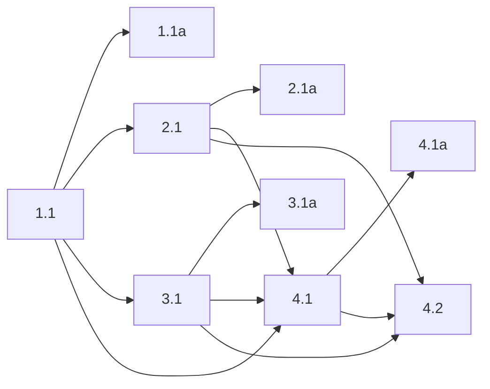

## 1. Pager parsing and reconstruction core
- [ ] 1.1 Add fork-owned pager-mode helpers under `packages/coding-agent/src/danger-pi/` that parse assistant `<pager-index>` pages, extract workflow/page titles from ordered Markdown lists, and reconstruct branch-local pager state by walking backward over assistant index pages plus `pager-next` / `pager-exit` custom messages.
- [ ] 1.1a Verify parser/reconstruction behavior with focused tests covering valid index parsing, malformed index rejection, backward-walk reconstruction, ignored stray events, and `next`-on-final-page collapsing to closed pager state; capture `bun test` output for the targeted file(s).

## 2. Pager commands and transcript protocol

- [ ] 2.1 Implement `/pager:next` and `/pager:exit` as fork-owned extension commands that emit visible `custom_message` entries via `sendMessage(..., { triggerTurn?: boolean })`, use the locked `system-notice` payloads for LLM-visible control text, special-render `Paging Next` / `Paging Exit`, and trigger the next assistant page only from `/pager:next`.
- [ ] 2.1a Verify command behavior with targeted tests covering custom-message payload shape, renderer labeling, immediate status target selection for `/pager:next`, no follow-up turn for `/pager:exit`, and final-page `/pager:next` behaving like exit; capture `bun test` output for the targeted file(s).

## 3. Status synchronization and session navigation hooks

- [ ] 3.1 Wire pager-mode status refresh so keyed status is derived from reconstructed state on `session_start`, `session_switch`, `session_branch`, same-file `session_tree` rewinds, assistant index-message arrival, `/pager:next`, and `/pager:exit`, using the exact display forms `[0/{n}] {title}: Index` and `[{i}/{n}] {page_title}`.
- [ ] 3.1a Verify status synchronization with targeted tests covering initial activation from an index page, immediate post-`next` status advancement, status clearing on exit, and reconstruction after navigating onto another branch/leaf; capture `bun test` output for the targeted file(s).

## 4. Built-in extension wiring and interactive evaluation

- [ ] 4.1 Wire pager-mode into the fork's built-in inline-extension load path in `packages/coding-agent/src/sdk.ts` so interactive sessions get the feature automatically without user configuration, keeping the implementation concentrated in `packages/coding-agent/src/danger-pi/`.
- [ ] 4.1a Verify built-in loading with a focused session-initialization test that proves pager-mode registers its commands/renderers/status hooks when OMP starts; capture `bun test` output for the targeted file(s).
- [ ] 4.2 (HUMAN_REQUIRED) Run an interactive OMP session with a sample pager workflow, confirm the transcript rendering and keyed status are readable during index, next, branch rewind, and exit flows, and record any follow-up UX adjustments needed before broad use.

